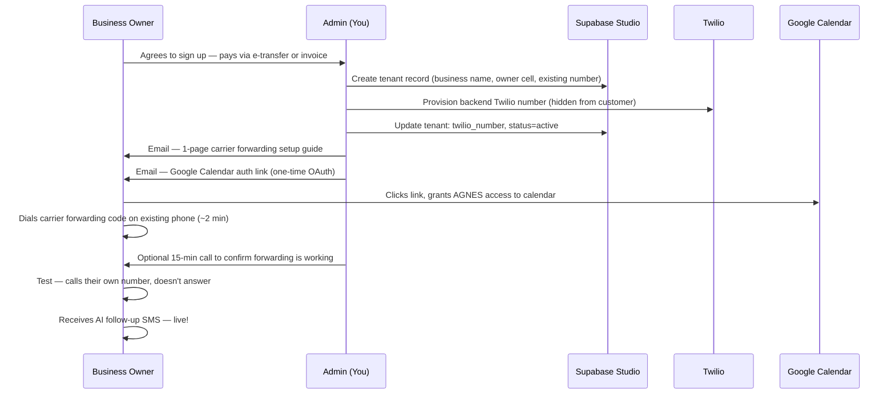
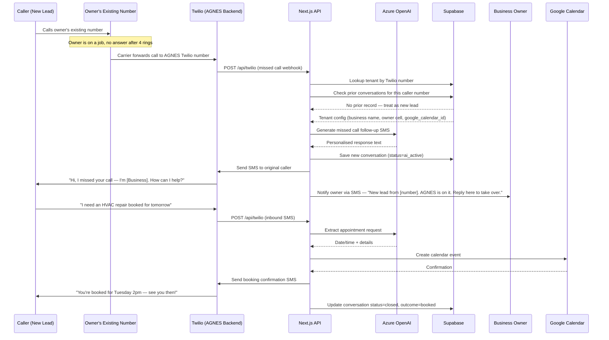
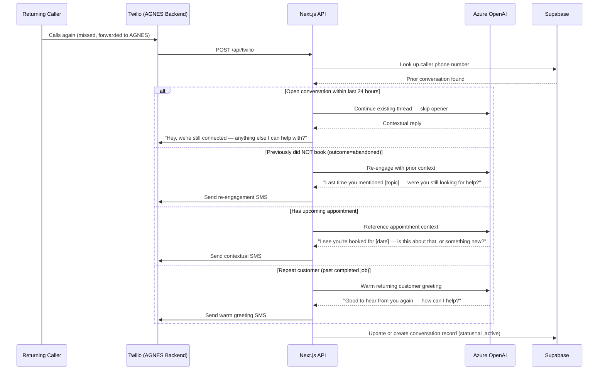
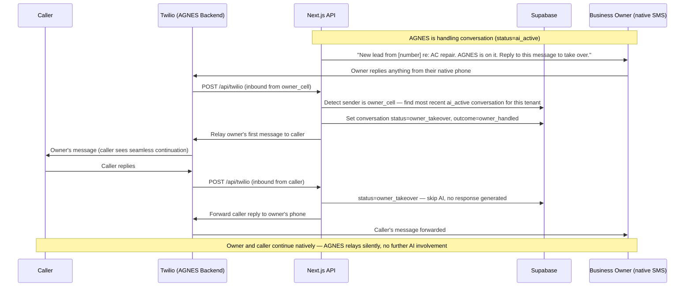
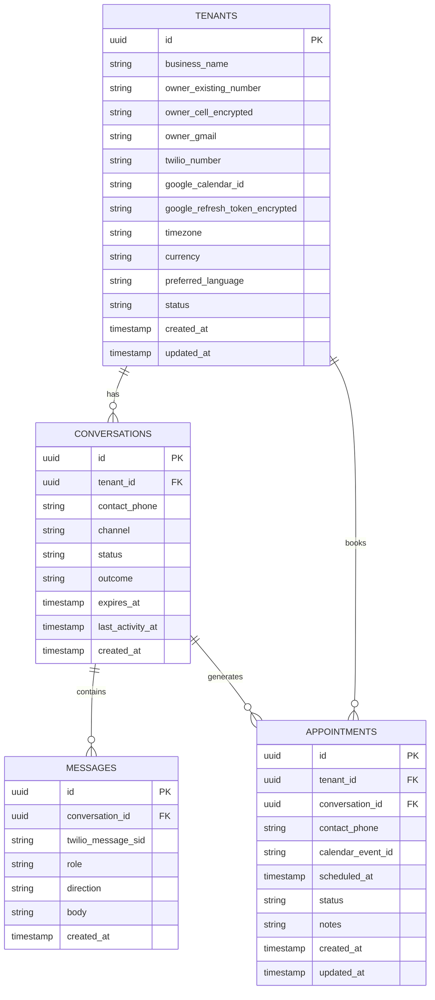
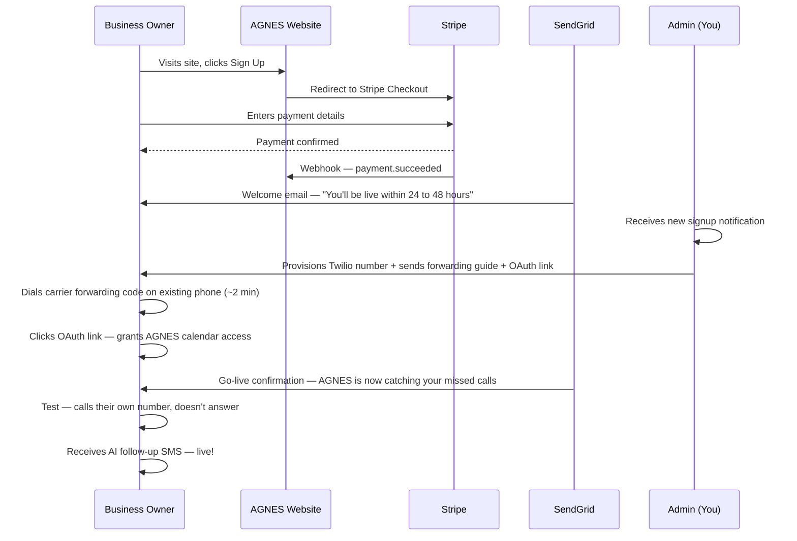
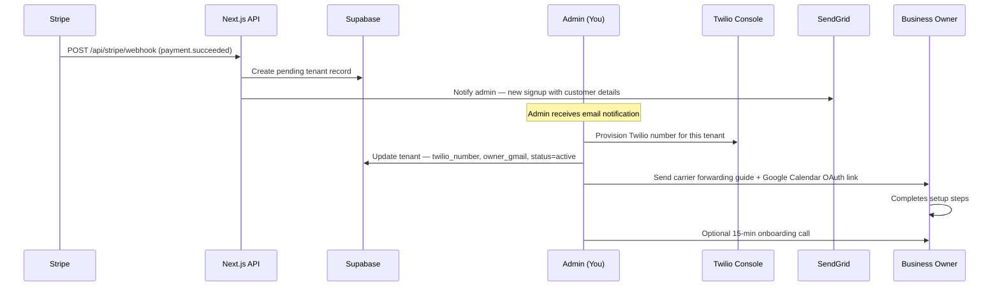
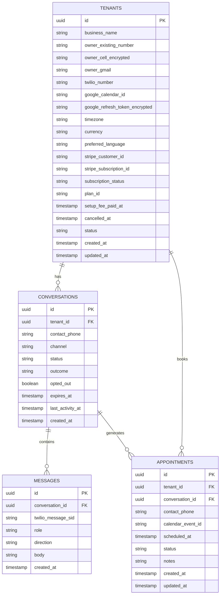

# Architecture Overview

# Phase 1

Covers the core system: missed call handling, AI responses, calendar booking, owner relay, and marketing website. Runs on Vercel free tier with Supabase. Manual tenant provisioning by admin. 

## Onboarding Flow — Customer Journey

## Conversation Flow — Missed Call to Booked Appointment

## Conversation Flow — Returning Caller

## Conversation Flow — Owner Takeover via Native SMS

## Data Model

> All Phase 2 columns — `stripe_customer_id`, `stripe_subscription_id`, `subscription_status`, `plan_id`, `cancelled_at`, `setup_fee_paid_at` — and `opted_out` are created in the Phase 1 migration as nullable/false. No migration needed when Phase 2 is activated.

## Notes — Phase 1

- **Number model:** The owner keeps their existing phone number. AGNES uses a hidden Twilio number as the forwarding target. Callers always dial the owner's number and never see the Twilio number.
- **Call forwarding:** Owner configures no-answer forwarding on their carrier using a single dial code (~2 min). AGNES provides per-carrier instructions at onboarding.
- **AGNES trigger:** Missed calls only. Twilio call status callbacks (`no-answer`, `busy`, `failed`) gate all AI activity. If the owner answers, AGNES plays no role.
- **Voice TwiML:** The webhook must return `<Hangup/>` immediately when a forwarded call arrives — this ends the call gracefully and allows the StatusCallback to fire the SMS chain.
- **Follow-up policy:** One AI-generated SMS after a missed call. No reminders. No scheduled jobs.
- **Owner takeover:** When the owner replies to any AGNES notification from their `owner_cell`, the conversation is marked `owner_takeover` and AGNES stops generating AI responses. AGNES continues relaying silently. No commands needed — first reply triggers it.
- **CASL compliance:** Canada-first. Callers who dialled the owner's number provide implied consent for a single service-response SMS. The `currency` field determines jurisdiction for future US onboarding (`USD` = TCPA).
- **Data retention:** `expires_at` is set to `created_at + 90 days`. Manual purge for Phase 1.
- **Idempotency:** `twilio_message_sid` has a UNIQUE constraint on `MESSAGES`. Duplicate webhook deliveries are silently ignored.
- **Serverless timeout:** The handler returns HTTP 200 immediately. AI calls, DB writes, and outbound SMS are dispatched asynchronously via Vercel `waitUntil`.
- **Conversation lifecycle:** `status`: `ai_active` → `owner_takeover` → `closed`. `outcome`: `booked`, `owner_handled`, `abandoned`, or `no_response`.
- **Multi-tenancy:** All data is scoped by `tenant_id`. Supabase Row-Level Security (RLS) enforces isolation — RLS policies must be authored alongside the schema migration.
- **Google Calendar OAuth:** Admin adds owner Gmail to the Google Cloud Console allowlist (30 sec per customer), then sends a one-time OAuth link in the go-live email. AGNES stores the refresh token encrypted via Supabase Vault and handles token refresh transparently (`401` → refresh → retry). The app stays in testing mode for Phase 1 — no Google verification needed.
- **Encryption:** `owner_cell_encrypted` and `google_refresh_token_encrypted` use Supabase Vault (built-in, free tier).

# Phase 2

> Adds to Phase 1: Stripe payment integration, SendGrid transactional email, Sentry error monitoring, Admin Dashboard UI, STOP/opt-out compliance, and automated onboarding notification from Stripe.

## Onboarding Flow — Customer Journey

> Owner signs up via the website. Stripe handles payment. Admin is notified and completes provisioning.

## Onboarding Flow — Admin Setup

> Stripe payment triggers admin notification. Admin still manually provisions the Twilio number. Full self-serve provisioning is post-Phase 2.

## Data Model — Phase 2 (Full Target Schema)

> Adds to Phase 1 schema: `opted_out` on CONVERSATIONS (STOP/opt-out handling), and Stripe fields populated on TENANTS.

## Notes — Phase 2

- **Stripe integration:** Webhooks `payment.succeeded`, `invoice.payment_failed`, `invoice.paid`, and `customer.subscription.deleted` update tenant `status` and `subscription_status` automatically.
- **Payment failure:** On `invoice.payment_failed`, tenant `status` is set to `suspended` and AGNES stops responding. Status returns to `active` automatically on `invoice.paid`.
- **STOP / opt-out:** Inbound STOP sets `opted_out = true` on the conversation. All outbound paths check this flag before sending. Required before going public.
- **SendGrid:** Transactional emails for welcome, go-live, and payment receipts. Free tier: 100/day.
- **Sentry:** Add when Vercel function logs alone are insufficient (typically at 10+ customers).
- **Admin Dashboard:** Read-only page showing tenants and daily conversation counts. Use Supabase Studio for anything deeper.
- **Google OAuth verification:** Required before going public so any Google account can authorize without a warning screen. Takes 1–4 weeks — requires a published Privacy Policy URL. Start before building the Phase 2 sign-up flow.
- **Customer offboarding:** When a customer cancels, stamp `cancelled_at`, release the Twilio number back to the pool, revoke Google Calendar OAuth, and set `status = cancelled`. Close any open conversations. No data is deleted — retained for the 90-day window then purged normally.